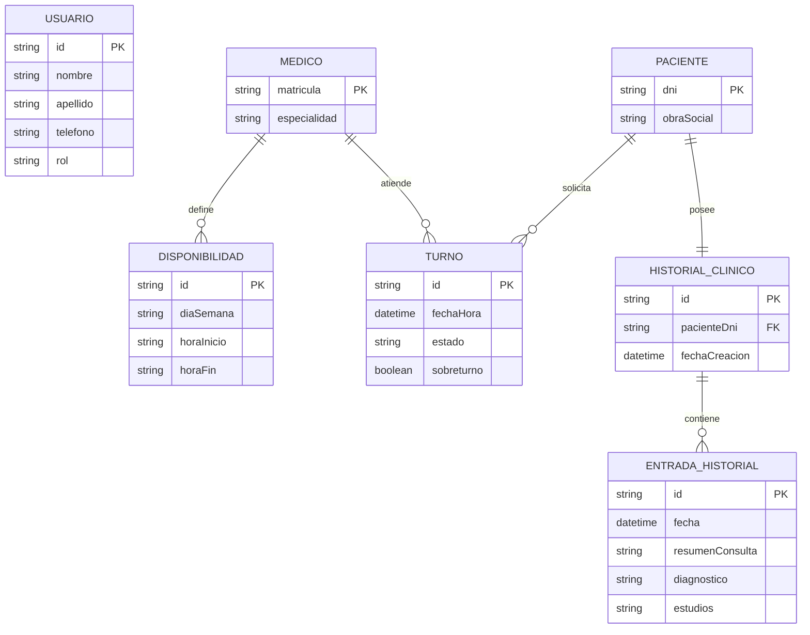
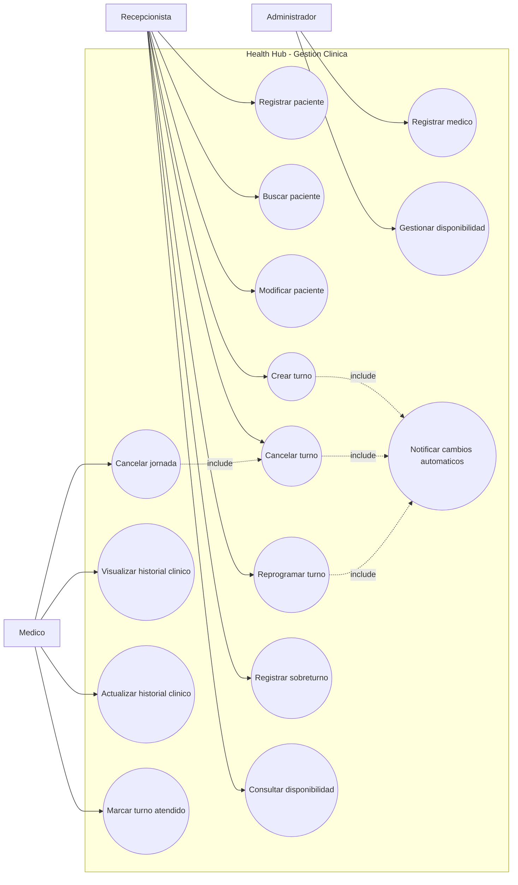
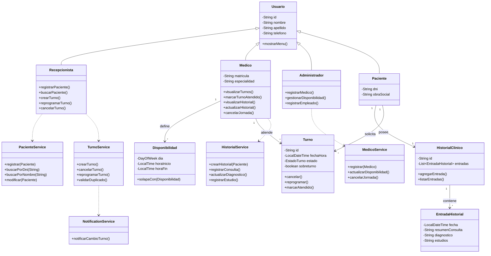

# Visualización de Diagramas Mermaid

## 1) Diagrama Entidad-Relación

```mermaid
erDiagram
    USUARIO {
        string id PK
        string nombre
        string apellido
        string telefono
        string rol
    }

    PACIENTE {
        string dni PK
        string obraSocial
    }

    MEDICO {
        string matricula PK
        string especialidad
    }

    DISPONIBILIDAD {
        string id PK
        string diaSemana
        string horaInicio
        string horaFin
    }

    TURNO {
        string id PK
        datetime fechaHora
        string estado
        boolean sobreturno
    }

    HISTORIAL_CLINICO {
        string id PK
        string pacienteDni FK
        datetime fechaCreacion
    }

    ENTRADA_HISTORIAL {
        string id PK
        datetime fecha
        string resumenConsulta
        string diagnostico
        string estudios
    }

    PACIENTE ||--|| HISTORIAL_CLINICO : posee
    HISTORIAL_CLINICO ||--o{ ENTRADA_HISTORIAL : contiene
    MEDICO ||--o{ DISPONIBILIDAD : define
    PACIENTE ||--o{ TURNO : solicita
    MEDICO ||--o{ TURNO : atiende
```

## 2) Diagrama de Casos de Uso

```mermaid
flowchart LR
    R[Recepcionista]
    M[Medico]
    A[Administrador]

    subgraph Sistema[Health Hub - Gestion Clinica]
        UC1((Registrar paciente))
        UC2((Buscar paciente))
        UC3((Modificar paciente))
        UC4((Crear turno))
        UC5((Cancelar turno))
        UC6((Reprogramar turno))
        UC7((Registrar sobreturno))
        UC8((Consultar disponibilidad))
        UC9((Registrar medico))
        UC10((Gestionar disponibilidad))
        UC11((Cancelar jornada))
        UC12((Visualizar historial clinico))
        UC13((Actualizar historial clinico))
        UC14((Marcar turno atendido))
        UC15((Notificar cambios automaticos))
    end

    R --> UC1
    R --> UC2
    R --> UC3
    R --> UC4
    R --> UC5
    R --> UC6
    R --> UC7
    R --> UC8

    A --> UC9
    A --> UC10

    M --> UC11
    M --> UC12
    M --> UC13
    M --> UC14

    UC4 -. include .-> UC15
    UC5 -. include .-> UC15
    UC6 -. include .-> UC15
    UC11 -. include .-> UC5
```

## 3) Diagrama de Clases

```mermaid
classDiagram
    class Usuario {
      -String id
      -String nombre
      -String apellido
      -String telefono
      +mostrarMenu()
    }

    class Recepcionista {
      +registrarPaciente()
      +buscarPaciente()
      +crearTurno()
      +reprogramarTurno()
      +cancelarTurno()
    }

    class Medico {
      -String matricula
      -String especialidad
      +visualizarTurnos()
      +marcarTurnoAtendido()
      +visualizarHistorial()
      +actualizarHistorial()
      +cancelarJornada()
    }

    class Administrador {
      +registrarMedico()
      +gestionarDisponibilidad()
      +registrarEmpleado()
    }

    class Paciente {
      -String dni
      -String obraSocial
    }

    class Turno {
      -String id
      -LocalDateTime fechaHora
      -EstadoTurno estado
      -boolean sobreturno
      +cancelar()
      +reprogramar()
      +marcarAtendido()
    }

    class HistorialClinico {
      -String id
      -List~EntradaHistorial~ entradas
      +agregarEntrada()
      +listarEntradas()
    }

    class EntradaHistorial {
      -LocalDateTime fecha
      -String resumenConsulta
      -String diagnostico
      -String estudios
    }

    class Disponibilidad {
      -DayOfWeek dia
      -LocalTime horaInicio
      -LocalTime horaFin
      +solapaCon(Disponibilidad)
    }

    class PacienteService {
      +registrar(Paciente)
      +buscarPorDni(String)
      +buscarPorNombre(String)
      +modificar(Paciente)
    }

    class MedicoService {
      +registrar(Medico)
      +actualizarDisponibilidad()
      +cancelarJornada()
    }

    class TurnoService {
      +crearTurno()
      +cancelarTurno()
      +reprogramarTurno()
      +validarDuplicado()
    }

    class HistorialService {
      +crearHistorial(Paciente)
      +registrarConsulta()
      +actualizarDiagnostico()
      +registrarEstudio()
    }

    class NotificationService {
      +notificarCambioTurno()
    }

    Usuario <|-- Recepcionista
    Usuario <|-- Medico
    Usuario <|-- Administrador
    Usuario <|-- Paciente

    Paciente "1" --> "1" HistorialClinico : posee
    HistorialClinico "1" --> "*" EntradaHistorial : contiene
    Medico "1" --> "*" Disponibilidad : define
    Medico "1" --> "*" Turno : atiende
    Paciente "1" --> "*" Turno : solicita

    Recepcionista ..> PacienteService
    Recepcionista ..> TurnoService
    Administrador ..> MedicoService
    Medico ..> HistorialService
    TurnoService ..> NotificationService
```
