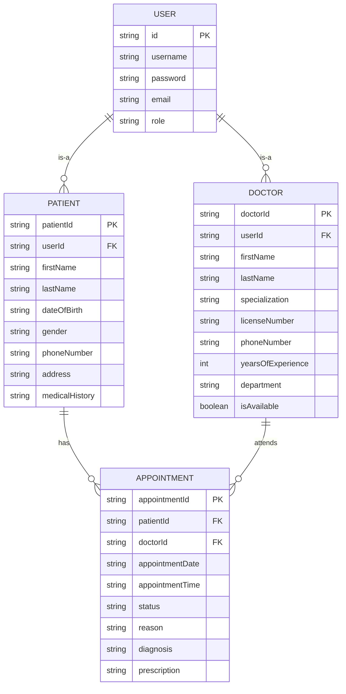
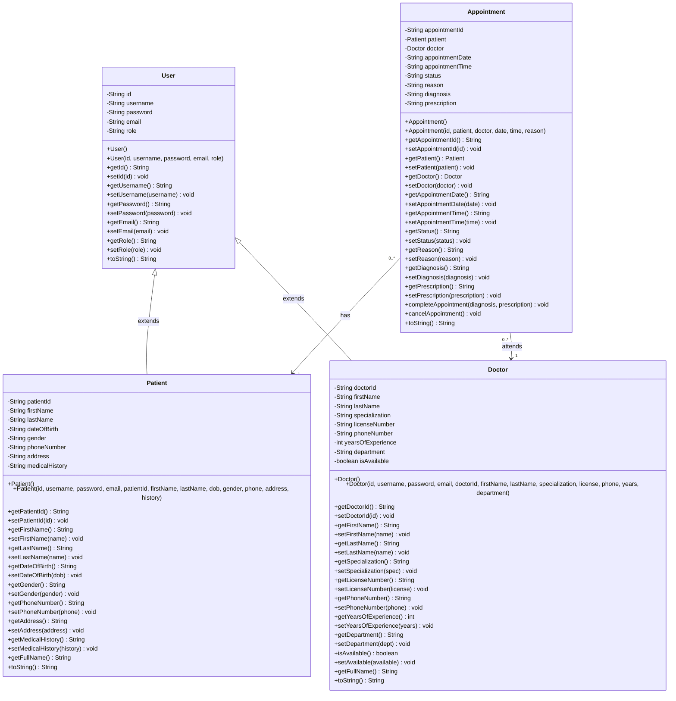
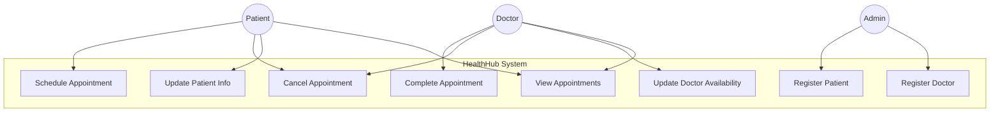
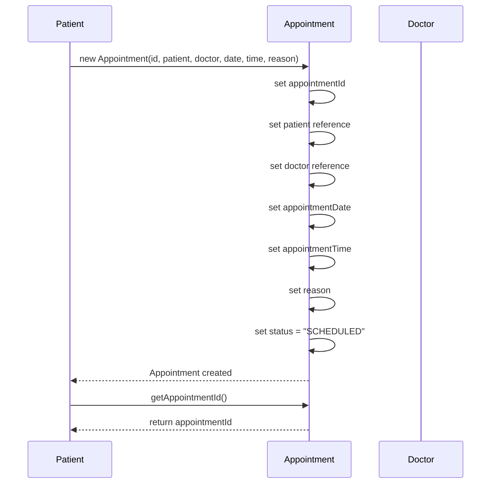
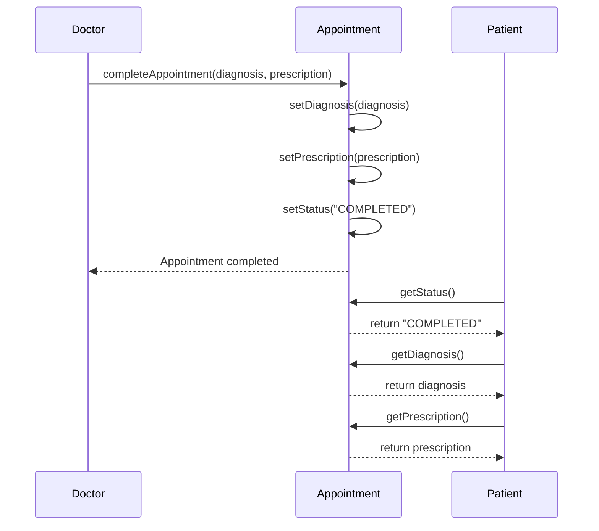
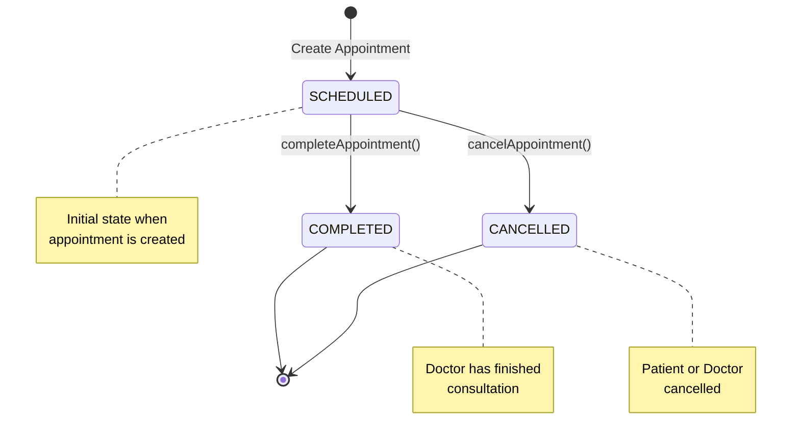
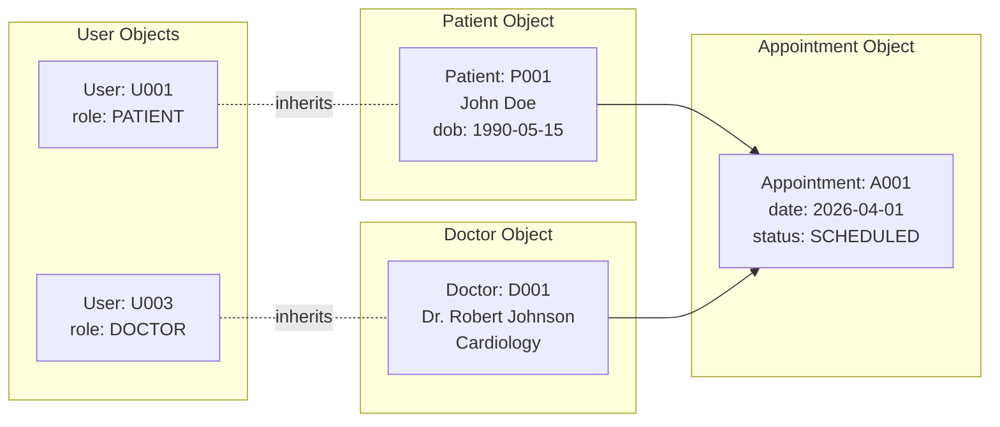
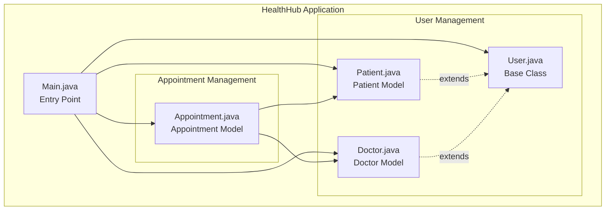

# HealthHub - Diagramas del Sistema

## Diagrama Entidad-Relación (DER)

---

## Diagrama de Clases (UML)

---

## Diagrama de Casos de Uso

---

## Diagrama de Secuencia - Agendar Cita

---

## Diagrama de Secuencia - Completar Cita

---

## Diagrama de Estados - Appointment

---

## Diagrama de Objetos - Ejemplo en Runtime

---

## Diagrama de Componentes

---

## Cardinalidades del Sistema

| Relación | Cardinalidad | Descripción |
|----------|--------------|-------------|
| User → Patient | 1:0..1 | Un usuario puede ser 0 o 1 paciente |
| User → Doctor | 1:0..1 | Un usuario puede ser 0 o 1 doctor |
| Patient → Appointment | 1:N | Un paciente puede tener muchas citas |
| Doctor → Appointment | 1:N | Un doctor puede atender muchas citas |
| Appointment → Patient | N:1 | Muchas citas pertenecen a un paciente |
| Appointment → Doctor | N:1 | Muchas citas son atendidas por un doctor |

---

## Restricciones de Integridad

1. **User.id** debe ser único
2. **Patient.patientId** debe ser único
3. **Doctor.doctorId** debe ser único
4. **Appointment.appointmentId** debe ser único
5. **Appointment.patient** no puede ser null
6. **Appointment.doctor** no puede ser null
7. **Doctor.licenseNumber** debe ser único
8. **Appointment.status** solo puede ser: SCHEDULED, COMPLETED, CANCELLED

---

**Fin de Diagramas**
